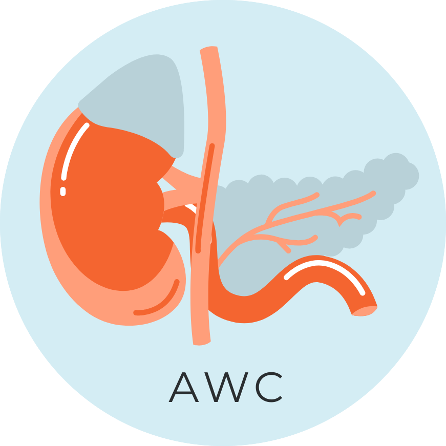
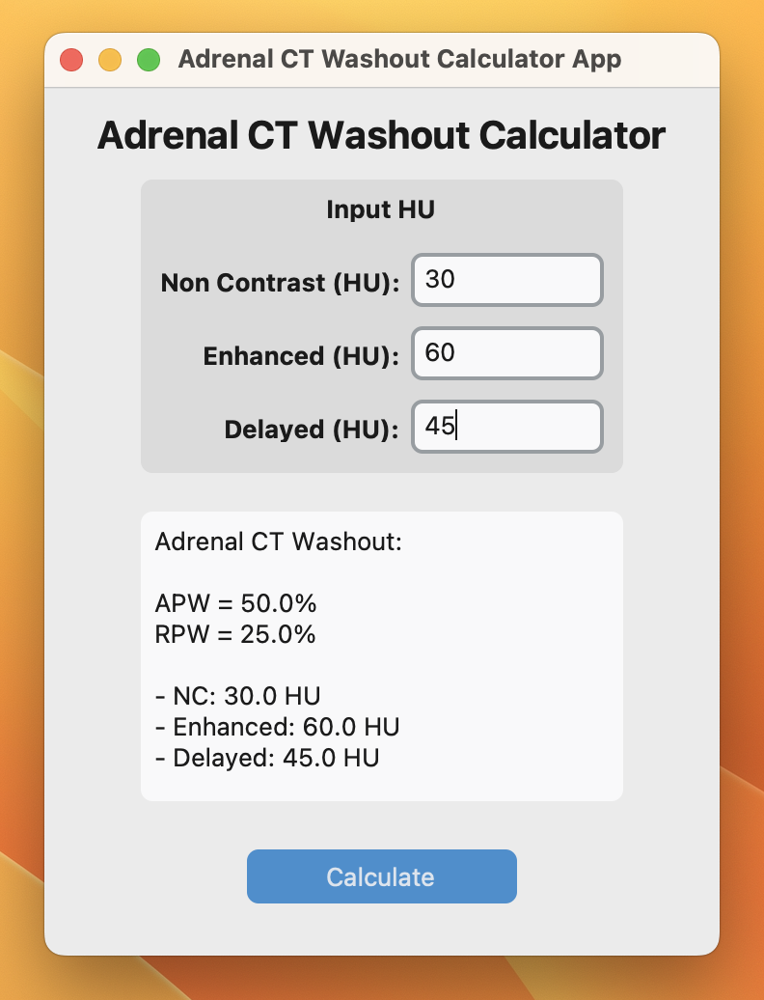
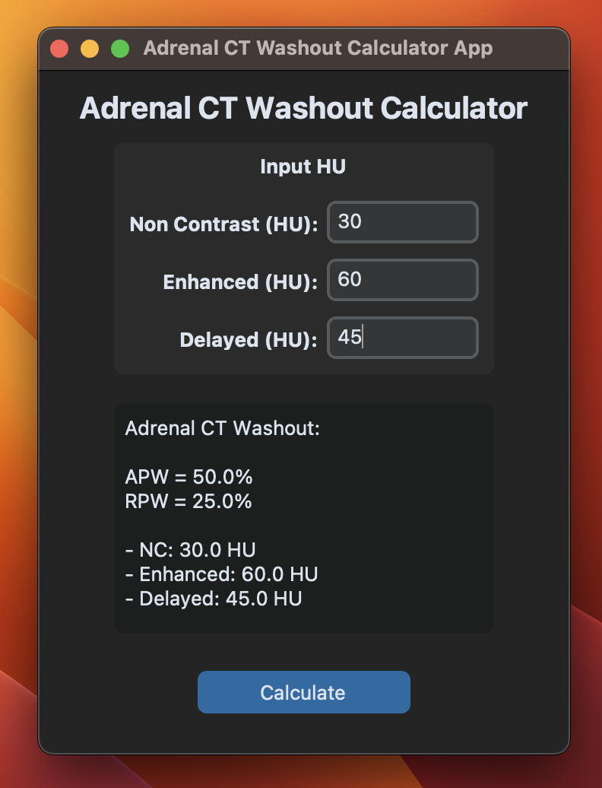

# Adrenal CT Washout Calculator 

> **A desktop application for calculate adrenal percentage washout in multiphase CT.**

-   Implemented using [CustomTkinter](https://github.com/TomSchimansky/CustomTkinter) Python package.

-   Download executable app: [here](https://github.com/Lightbridge-KS/adrenal_washout_app/releases) (available in Windows and MacOS)

Light             |  Dark
:-------------------------:|:-------------------------:
  |  

### Reference

- Boland, G. W. L. (2011). Adrenal imaging: Why, when, what, and how? Part 2. What technique? American Journal of Roentgenology, 196(1), W1–W5. https://doi.org/10.2214/AJR.10.4205
- [CustomTkinter](https://github.com/TomSchimansky/CustomTkinter) package