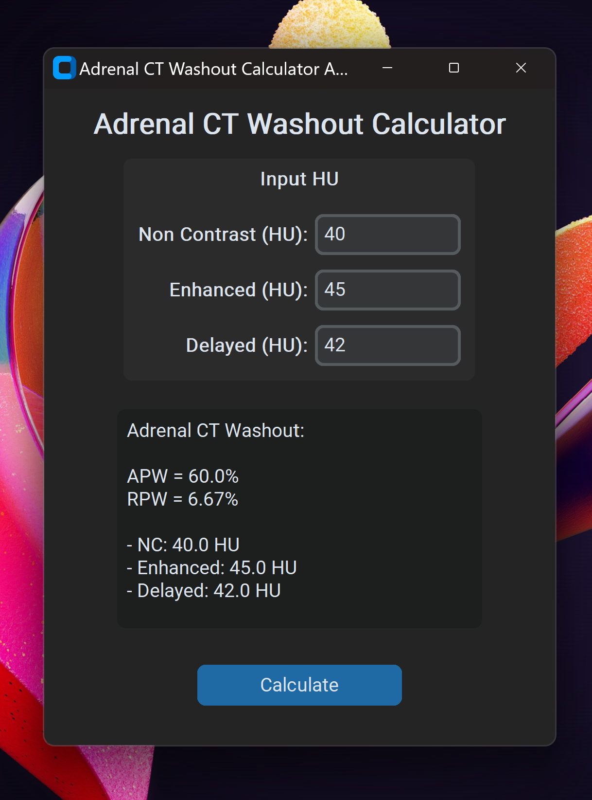

# Adrenal CT Washout Calculator 

> A desktop application for calculate adrenal washout in multiphase CT.

-   Implemented using [CustomTkinter](https://github.com/TomSchimansky/CustomTkinter) Python package.

-   Build for Windows and MacOS.

Light             |  Dark
:-------------------------:|:-------------------------:
  |  

| MacOS

| Windows

